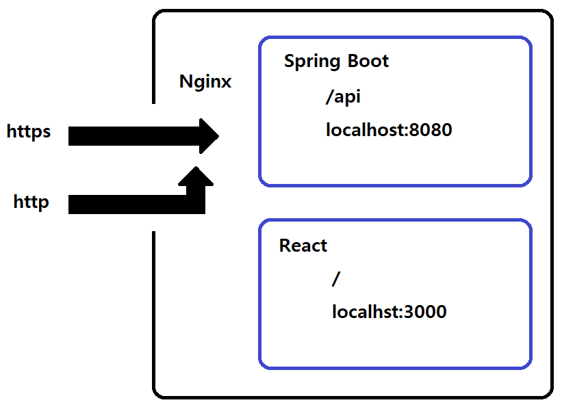

# MAG
`Make A General`의 약자로 해당 프로젝트를 진행하며 스스로 발전하여 자신을 장군님으로 만들어보자는 취지로 만들어진 프로젝트입니다.

## 목차
- [Spring boot](#spring-boot)
- [React](#React)
- [학습내용 Spring](./docs/learning-spring.md)
- [학습내용 React](./docs/learning-react.md)

## Spring Boot
API 서버로서 Spring 프레임워크를 사용했습니다.

### 프로젝트 구조
```
api/src
├─ main
│   ├─ main
│   │   ├─ java.hjh.api.controller
│   │   │   └─ controller...
│   │   ├─ java.hjh.api.service
│   │   │   └─ service...
│   │   ├─ java.hjh.api.repository
│   │   │   └─ repository...
│   │   ├─ java.hjh.api.domain.entity
│   │   │   └─ entity...
│   │   ├─ java.hjh.api.domain.dto
│   │   │   └─ dto...
│   │   └─ java.hjh.api.domain.type
│   │       └─ type...
│   └─ resources
│       ├─ application-local.properties
│       ├─ application-prod.properties
│       └─ application.properties
└─ test
    └─ 테스트 코드...
```

## React
Front-End 서버로서 Spring 프레임워크를 사용했습니다.

### 프로젝트 구조
```
front
├─ public
├─ src
│   ├─ component
│   │   └─ component...
│   ├─ page
│   │   └─ page...
│   ├─ style
│   │   └─ style...
│   ├─ resources
│   │   └─ img
│   │       └─ 이미지...
│   ├─ App.jsx
│   ├─ App.css
│   └─ index.jsx
└─ package.json
```

### 서버 구성도


### Proxy Server
- 클라이언트가 자신을 통해서 다른 네트워크 서비스에 간접적으로 접속할 수 있게 해 주는 컴퓨터 시스템이나 응용 프로그램을 가리킨다. 
- 서버와 클라이언트 사이에 중계기로서 대리로 통신을 수행하는 것을 가리켜 ‘프록시’, 그 중계 기능을 하는 것을 프록시 서버라고 부른다.

### Nginx
- Nginx를 통해 Front-End 서버와 API 서버를 하나의 서버처럼 동작하도록 구성합니다. 이를 프록시 서버(proxy server)라고 합니다.
- SSL 설정을 하고 http 요청을 https 요청으로 리다이렉트 시킵니다.

### SSL